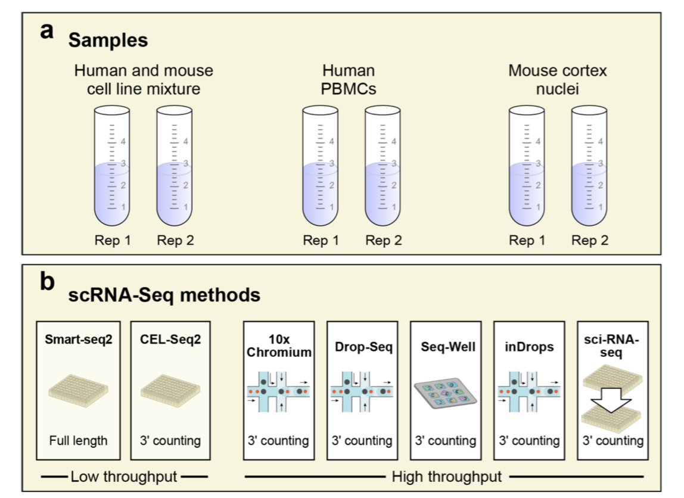
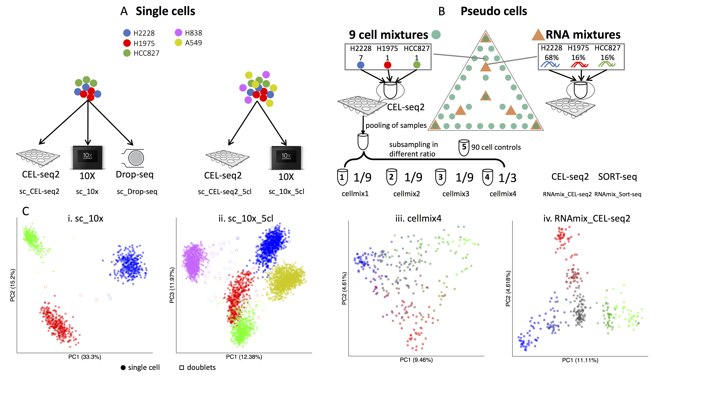

```{r setup, include=FALSE}
knitr::opts_chunk$set(echo = FALSE)
```


# Introduction to Computational Challenge

As part of Oz Single Cell 2019 conference, we are hosting a single cell data analysis challenge. The challenge aims to foster the development of ideas and approaches to better utilise data arising from single cell sequencing technology, specifically using one or more of three single cell data sets. We encourage innovation from any aspect of single cell analytics from the extraction of biological insight through to complex analytical approaches.
Possible entries to the challenge include:

+	Technological innovation including better quality control, normalization pipeline, frameworks for comparison of pipelines, 
+	Biological discovery or confirmation, 
+	Analytical innovation including integration with other data sets, high-level visualisation and others. 
Please note that entries are not limited to the above suggestions and participants are strongly encouraged to come up with new ways for utilizing these types of data.

# Challenge Entrants

Teams can consist of any number of people, but we encourage teams to have a mix of students, postdocs, and more senior academic staff. 
To register your team, please fill in our form [here](https://docs.google.com/forms/d/e/1FAIpQLSebsq7sjQnaodGPNx0vY_KFnsgC2FdvTm-ODvYEt2E-TbiXWg/viewform?usp=sf_link), note that this is not binding and you can change your mind later. 
On 15th July, we will ask each team entering the challenge to provide us with a 200-word description of their entry.  

<style>
div.blue { background-color:#e6f0ff; border-radius: 3px; padding: 20px}
</style>
<div class = "blue">

**The entries close at 5pm on Friday 19th July.**

</div>


# Judging criteria

Participants are invited to present their analysis during the Oz Single Cell conference. Each team will be allocated a 3 min rapid-fire talk and a panel will judge the entries.
The entries will be judged according to the novelty and potential impact on future single cell work. This could be in any of the following areas:


+ Computational techniques
+ Analysis methodology
+ Biological insight

In addition, the clarity and coherence of the presentation will be taken into account.

# Datasets

### Dataset 1 - Swarbrick Lab CITE-seq data

##### SHORT SUMMARY
Dataset from the Swarbrick lab provides the participants with an opportunity to explore CITE-seq, a powerful new technology that allows simultaneous characterisation of both RNA and surface proteins. Hackers are invited to build stories around the biological (metastatic lymph node) or technical aspects (normalisation, visualisation, integration) of the data. 

##### BACKGROUND
Cell-surface proteins were historically crucial in describing cellular states, and were often a more reliable indicator of cellular activity and function than RNA expression. The Swarbrick Lab from Garvan Institute has implemented CITE-seq technology (Stoeckius et al. 2017) that couples protein and RNA information for individual cells, allowing a more powerful characterization of cellular phenotypes than transcriptome measurements alone. 

##### DATA
In the experiment below we applied multimodal analysis to phenotype immune cells in a human metastatic lymph node. After spiking in mouse cells (3T3) and staining with 96 CITE-seq antibodies (with IgG1, IgG2a and IgG2b as isotype controls), the samples were analysed on Chromium 10x. All of the above are available in raw format or normalized and scaled Seurat objects (v3).

##### CHALLENGES
1.	Subset and visualize different cell populations using integrated RNA and CITE-seq data to determine differences between cellular populations
2.	Improve the default statistical framework for the QC of CITE antibodies using mouse spike-ins and IgG controls
3.	Compare CITE profiles with publicly available cell-type signatures (i.e. www.immgen.org)

##### DOWNLOAD 
1.	RAW CITE-seq COUNTS:
+ csv file: [link](http://www.maths.usyd.edu.au/u/SMS/bioinformatics/wwwnb/CITE-seq/Swarbrick_metastatic_lymphnode.CITE.csv)
+ raw_gene_bc_matrices_h5.h5 [link](http://www.maths.usyd.edu.au/u/SMS/bioinformatics/wwwnb/CITE-seq/raw_gene_bc_matrices_h5.h5)
+ filtered_gene_bc_matrices_h5.h5 [link](http://www.maths.usyd.edu.au/u/SMS/bioinformatics/wwwnb/CITE-seq/filtered_gene_bc_matrices_h5.h5)
+ Swarbrick_metastatic_lymphnode.CITE.csv 

2.	SEURAT OBJECT (.RData file: [link](http://www.maths.usyd.edu.au/u/SMS/bioinformatics/wwwnb/CITE-seq/Swarbrick_metastatic_lymphnode.seurat.Rdata))
+ Swarbrick_metastatic_lymphnode.seurat.Rdata
+ Seurat (v3) object with raw and processed data human and mouse data, with CITE-seq counts (RNA and ADT (antibody-derived tags)) included. 
+ data processed with Seurat_3.0.0.9100, normalized with SCTransform (stored in SCT assay) 
3.	ANTIBODY ANNOTATION (csv file: [link](http://www.maths.usyd.edu.au/u/SMS/bioinformatics/wwwnb/CITE-seq/antibody_isotype.csv))
+ antibody_isotypes.csv 

3. `SingleCellExperiment` Object (.RData file: 
[link](http://www.maths.usyd.edu.au/u/SMS/bioinformatics/wwwnb/CITE-seq/Swarbrick_metastatic_lymphnode.sce.Rdata)
)


### Dataset 2 - Benchmarking datasets


#### Dataset 2.1 - Ding et al. Benchmark Datasets

##### DESCRIPTION 
 

A multitude of single-cell RNA sequencing methods have been developed in recent years, with dramatic advances in scale and power, and enabling major discoveries and large scale cell mapping efforts. However, these methods have not been systematically and comprehensively benchmarked. Here, we directly compare seven methods for single cell and/or single nucleus profiling from three types of samples – cell lines, peripheral blood mononuclear cells and brain tissue – generating 36 libraries in six separate experiments in a single center. To analyze these datasets, we developed and applied scumi, a flexible computational pipeline that can be used for any scRNA-seq method. We evaluated the methods for both basic performance and for their ability to recover known biological information in the samples. Our study will help guide experiments with the methods in this study as well as serve as a benchmark for future studies and for computational algorithm development. 

 

##### DOWNLOAD

**PBMC data**

There are two experiments (PBMC1 and PBMC2), each with x7 scRNA-seq methods (Sci-Seq, Smart-seq2, CEL-seq2, 10x_v2,Seq-well, Drop-seq, inDrops): 31021 cells:

https://portals.broadinstitute.org/single_cell/study/SCP424/single-cell-comparison-pbmc-data


**Cortex data**

Cortex data 13783 cells, the mouse Cortex single nucleus RNA-seq (snRNA-seq) experiments. These consist of two experiments (Cortex1 and Cortex2), each with 4 snRNA-seq methods (10X, DroNc-Seq, Sci-RNA-Seq, and Smart-seq2):
 
https://portals.broadinstitute.org/single_cell/study/SCP425/single-cell-comparison-cortex-data

 
 
 
**Cell mixture**

cells mixture (HEK293 and NIH3T3) experiments: 28580 cells. These consist of two experiments (Mixture1 and Mixture2), each with x7 scRNA-seq methods.  This dataset allowed us to better understand the ability of different methods to detect gene expression (detecting doublets):
 
https://portals.broadinstitute.org/single_cell/study/SCP424/single-cell-comparison-pbmc-data


##### REFERENCE

Ding, J. et al., 2019. Systematic comparative analysis of single cell RNA-sequencing methods. bioRxiv, p.632216. Available at: https://www.biorxiv.org/content/10.1101/632216v2.


#### Dataset 2.2 - CellBench: single cell RNA-seq benchmarking


##### DESCRIPTION

CellBench uses three human lung adenocarcinoma cell lines HCC827, H1975 and H2228, which were cultured separately, and then processed in three different ways. Firstly, single cells from each cell line were mixed in equal proportions, with libraries generated using three different protocols: CEL-seq2, Drop-seq (with Dolomite equipment) and 10X Chromium. Secondly, the single cells were sorted from the three cell lines into 384-well plates, with an equal number of cells per well in different combinations (generally 9-cells, but with some 90-cell population controls). Thirdly, RNA was extracted in bulk for each cell line and the RNA was mixed in 7 different proportions and diluted to single cell equivalent amounts ranging from 3.75pg to 30pg and processed using CEL-seq 2 and SORT-seq. ERCC spike-in controls were present in samples processed using the 2 plate-based technologies (CEL-seq2 and SORT-seq).




##### DOWNLOAD

Raw data from this series of experiments is available under GEO accession number [GSE118767](https://www.ncbi.nlm.nih.gov/geo/query/acc.cgi?acc=GSE118767). The processed count data obtained from `scPipe` and stored in R objects that use the `SingleCellExperiment` class can be downloaded from https://github.com/LuyiTian/CellBench_data. The website contains instructions for getting the count data and metadata (including annotations) for each dataset. All data is post sample quality control, without gene filtering.


##### REFERENCE

Tian, L. et al., 2019. Benchmarking single cell RNA-sequencing analysis pipelines using mixture control experiments. Nature Methods, 16(6), pp.479–487. Available at: https://doi.org/10.1038/s41592-019-0425-8.


# Prize:

+ Computational challenge $1,000 team prize
+ Hackathon $1,000 team prize
+ Pitch Prize ($5k AGRF credit)


# Contact

If you have any questions about this challenge, feel free to email us at:
singlecellchallenge@maths.usyd.edu.au
