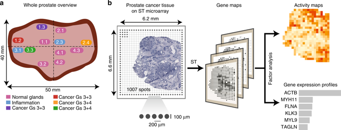

```{r setup, include=FALSE}
knitr::opts_chunk$set(echo = FALSE)
```


# Aim 
To facilitate collaboration among cellular genomics researchers around Australia and to explore and solve challenges in analysing one of the next frontiers in cellular genomics, spatial transcriptomics. The new datatype contains both imaging pixel data and sequencing read data.  

# The workshop format 

At the workshop, participants will form Hackathon teams to encourage team diversity regarding geographical locations, organisations, genders, and expertise. The Hackathon will mainly focus on interactive discussion and idea generation rather than real-time execution of data analysis programs. Attendants can produce algorithms and pseudo-codes to demonstrate how to implement the ideas, but no intensive computational runs are required. The teams should use their own laptops. In rare scenarios, should participants require access to HPC, they can use the Internet in the room for VPN connection. 

At the end of the workshop, flash presentations on spatial transcriptomics analysis ideas (5 minutes/team) will be ranked and there will be prizes for the winning teams, who will then also present on Tuesday at the main conference.

# Hackathon Dataset

#### DATASET DESCRIPTION 

Spatial transcriptomics data of prostate cancer tissues were generated by Lunderberg’s Lab. The study has been published in Nature Communications (Berglund et al, 2018). Prior to the workshop, participants are encouraged to read the paper and attend the two technology talks on spatial transcriptomics in the morning session Sunday 21st July. For those interested in working with the data before the workshop, provide raw and processed count matrices and images and can be downloaded here.  Raw Fastq files are available at European Genome–Phenome Archive (EGA) under the accession number EGAS0000100300. 





#### FILES 

1.	Raw count matrices: 12 tsv files containing raw read count data of Slide-seq spots in 12 tissue sections. (.zip files [link](http://www.maths.usyd.edu.au/u/SMS/bioinformatics/wwwnb/ProstateCancer/raw_matrices.zip))
2.	Coordinate-adjusted count matrices: we generated 12 tsv files, containing cooordinate-adjusted count data that match H&E images (.zip files [link](http://www.maths.usyd.edu.au/u/SMS/bioinformatics/wwwnb/ProstateCancer/adjusted_matrices.zip))
3.	High-resolution H&E images: 12 raw images kindly provided by the authors (.zip files [link](http://www.maths.usyd.edu.au/u/SMS/bioinformatics/wwwnb/ProstateCancer/images.zip))


#### SUGGESTED PROBLEMS

1) QC and normalisation of imaging data and sequencing data within a tissue section and between tissue sections
2) Identification of cell types and microenvironments
3) Identification of cell-cell interactions
4) Integration of imaging data and sequencing read count data 


# Reference:

Berglund, E. et al., 2018. Spatial maps of prostate cancer transcriptomes reveal an unexplored landscape of heterogeneity. Nature Communications, 9(1), p.2419. Available at: https://doi.org/10.1038/s41467-018-04724-5.

